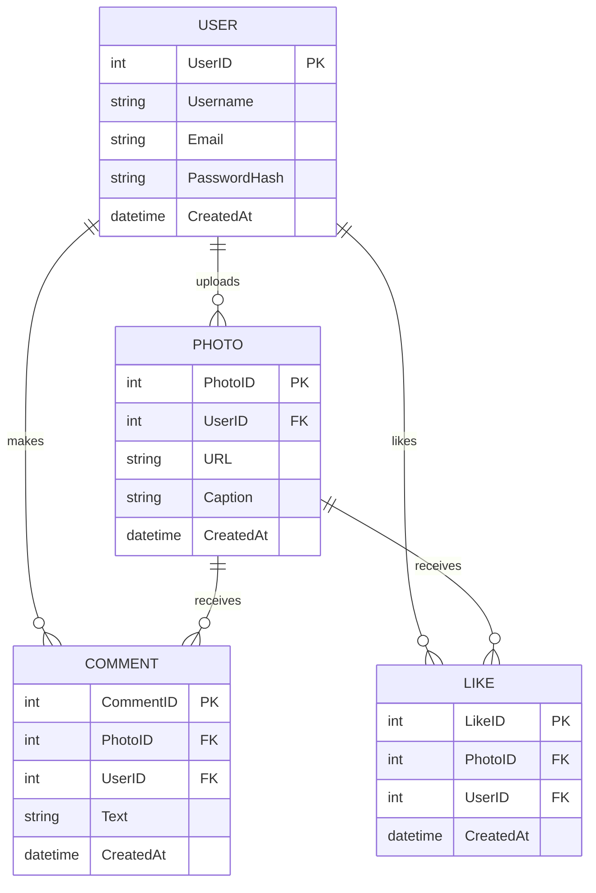

# SQL and PostgreSQL: The Complete Developer's Guide

[SQL and PostgreSQL: The Complete Developer's Guide](https://www.udemy.com/course/sql-and-postgresql)

You can create you PostgreSQL instance in Docker if you are not running Docker locally on machine with:

```bash
➜ docker run --name udemy_postgres -e POSTGRES_USER=udemy -e POSTGRES_PASSWORD=password -e POSTGRES_DB=udemy -p 5432:5432 -d postgres
```

## What is PostgreSQL?

PostgreSQL is a powerful, open-source object-relational database system. It has
more than 15 years of active development and a proven architecture that has
earned it a strong reputation for reliability, data integrity, and correctness.

## Database Design

Database design is the organization of data according to a database model. The
designer determines what data must be stored and how the data elements
interrelate. With this information, they can begin to fit the data to the
database model.

## Creating Tables

```sql
CREATE TABLE cities
(
  name       VARCHAR(100),
  country    VARCHAR(50),
  population INTEGER,
  area       INTEGER
);
```

As you can see, the `CREATE TABLE` statement is used to create a new table. The
table is defined by its name and by the names and data types of its columns. In
this case, the table is called `cities` and it has four columns: `name`,
`country`, `population`, and `area`.

## Inserting Data

```sql
INSERT INTO cities (name, country, population, area)
VALUES ('Tokyo', 'Japan', 38505000, 8223);
```

To add multiple rows to a table, you can use a single `INSERT` statement with

```sql
INSERT INTO cities (name, country, population, area)
VALUES ('Delhi', 'India', 25840000, 573),
       ('Shanghai', 'China', 23390000, 6340),
       ('Sao Paulo', 'Brazil', 21846507, 1521),
       ('Mumbai', 'India', 18410000, 484.5),
       ('Mexico City', 'Mexico', 17400000, 1485),
       ('Beijing', 'China', 17311000, 16410),
       ('Osaka', 'Japan', 16425000, 2230),
       ('Cairo', 'Egypt', 15600000, 606),
       ('New York City', 'United States', 19354922, 468.9),
       ('Dhaka', 'Bangladesh', 15443000, 306);
```

To retrieve all rows from a table, you can use the `SELECT` statement with the
`*` wildcard character.

```sql
SELECT *
FROM cities;
```

## Project 1

Write a `SELECT` statement that retrieves both rows inserted into the
`movies` table. Select both `title` and `box_office`` columns.

```sql
CREATE TABLE movies
(
  title      VARCHAR(100),
  box_office INTEGER
);

INSERT INTO movies (title, box_office)
VALUES ('Avatar', 27879650),
       ('Avengers: Endgame', 27978005);
```

```sql
SELECT title, box_office
FROM movies;
```

## Calculated Columns

```sql
SELECT name, population, area, population / area AS population_density
FROM cities;
```

## Math Operators

- `+` Addition
- `-` Subtraction
- `*` Multiplication
- `/` Division
- `%` Modulus
- `^` Exponentiation
- `|/` Square root
- `||/` Cube root
- `!!` Factorial
- `@` Absolute value
- `&` Bitwise AND
- `|` Bitwise OR
- `#` Bitwise XOR
- `~` Bitwise NOT
- `<<` Bitwise shift left
- `>>` Bitwise shift right

## Coding Exercise 2

Take a look at the following table called phones. This
table has already been inserted into the database for you.

Write a query that will select the name of each phone and calculate the total revenue for each phone (price X
units_sold)

Rename this calculated column to revenue

```sql
CREATE TABLE phones
(
  name       VARCHAR(100),
  price      INTEGER,
  units_sold INTEGER
);

INSERT INTO phones (name, price, units_sold)
VALUES ('iPhone 12', 799, 1000000),
       ('Galaxy S21', 699, 1500000),
       ('Pixel 5', 699, 500000),
       ('OnePlus 9', 699, 300000),
       ('Xperia 1', 699, 200000);
```

```sql
SELECT name, price * units_sold AS revenue
FROM phones;
```

## String Operators and Functions

- `||` Concatenation
- `LENGTH` Length
- `UPPER` Uppercase
- `LOWER` Lowercase
- `INITCAP` Capitalize
- `TRIM` Remove leading and trailing spaces
- `LTRIM` Remove leading spaces
- `RTRIM` Remove trailing spaces
- `REPLACE` Replace a substring
- `SUBSTRING` Extract a substring
- `POSITION` Find the position of a substring
- `LEFT` Extract characters from the left
- `RIGHT` Extract characters from the right
- `REPEAT` Repeat a string
- `REVERSE` Reverse a string
- `TRANSLATE` Replace multiple characters
- `TO_CHAR` Convert a number to a string
- `TO_NUMBER` Convert a string to a number
- `TO_DATE` Convert a string to a date
- `TO_TIMESTAMP` Convert a string to a timestamp
- `TO_TIMESTAMP_TZ` Convert a string to a timestamp with time zone
- `TO_JSON` Convert a row to JSON
- `TO_JSONB` Convert a row to JSONB
- `TO_XML` Convert a row to XML
- `TO_ASCII` Convert a string to ASCII
- `TO_HEX` Convert a string to hexadecimal
- `TO_BASE64` Convert a string to base64
- `TO_BYTEA` Convert a string to bytea
- `TO_CLOB` Convert a string to CLOB

```sql
SELECT *
FROM cities
WHERE LENGTH(name) > 5;
```

The above query retrieves all rows from the `cities` table where the length
of column `name` is greater than 5.

## `WHERE` Clause

The `WHERE` clause is used to filter records. The `WHERE` clause is used to
extract only those records that fulfill a specified condition.

```sql
SELECT *
FROM cities
WHERE country = 'India';
```

The above query retrieves all rows from the `cities` table where the value of
column `country` is equal to `India`.

## Order PostgreSQL reads the `WHERE` clause

1. `FROM` and `JOIN` clauses
2. `WHERE` clause
3. `SELECT` clause

## Compound `WHERE` Clauses

```sql
SELECT *
FROM cities
WHERE country = 'India'
  AND population > 20000000;
```

The above query retrieves all rows from the `cities` table where the value of
column `country` is equal to `India` and the value of column `population` is
greater than 20,000,000.

```sql
SELECT cities.name,
       cities.population
FROM cities
WHERE cities.name = 'Osaka';
```

The above query retrieves the `name` and `population` columns from the `cities`
table where the value of column `name` is equal to `Osaka`.

Let's try the `WHERE` and `IN` clauses.

```sql
SELECT cities.name,
       cities.population
FROM cities
WHERE cities.name IN ('Osaka', 'Tokyo');
```

The above query retrieves the `name` and `population` columns from the `cities`
table where the value of column `name` is either `Osaka` or `Tokyo`.

We could do the same query again and use the `NOT IN` clause.

```sql
SELECT cities.name,
       cities.population
FROM cities
WHERE cities.name NOT IN ('Osaka', 'Tokyo');
```

The above query retrieves the `name` and `population` columns from the `cities`
table where the value of column `name` is neither `Osaka` nor `Tokyo`.

Now let's try an `AND` and `OR` clause.

```sql
SELECT cities.name,
       cities.population
FROM cities
WHERE cities.name = 'Osaka'
   OR cities.name = 'Tokyo';
```

The above query retrieves the `name` and `population` columns from the `cities`
table where the value of column `name` is either `Osaka` or `Tokyo`.

## Exercise 3

Write a query that will print the name and price of all phones that have
sold more that 5000 units.

```sql
SELECT name, price
FROM phones
WHERE units_sold > 5000;
```

## Exercise 4

Write a query that will print out the name and price of only Apple and
Google phones.

```sql
SELECT name, price
FROM phones
WHERE name IN ('iPhone 12', 'Pixel 5');
```

Here we are selecting the name and price from phones where name is either
`iPhone 12` or `Pixel 5`.

## Calculations with `WHERE` Clause

```sql
SELECT name, population, area, population / area AS population_density
FROM cities
WHERE population / area > 5000;
```

We select the `name`, `population`, and `area` columns from the `cities` table
and calculate the `population_density` column. We then filter the results by
selecting only the rows where the value of `population_density` is greater than
5,000.

## Updating Rows

```sql
UPDATE cities
SET population = 38505000
WHERE name = 'Tokyo';
```

The above query updates the `population` column in the `cities` table to
`38,505,000` where the value of the `name` column is equal to `Tokyo`.

`SET` is used to specify the columns to be updated and the values they should be
given. `WHERE` is used to specify which rows should be updated.

## Deleting Rows

```sql
DELETE
FROM cities
WHERE name = 'Tokyo';
```

The above query deletes all rows from the `cities` table where the value of the
`name` column is equal to `Tokyo`.

Now lets update cities and add Tokyo back.

```sql
INSERT INTO cities (name, country, population, area)
VALUES ('Tokyo', 'Japan', 38505000, 8223);
```

And lets check to make sure that Tokyo is back in the table.

```sql
SELECT *
FROM cities
WHERE name = 'Tokyo';
```

## Database design

Sure! Let's design a schema for a photo-sharing app that includes the following entities: Users, Photos, Comments, and Likes.

### Entities and Attributes:

1. **Users:**
   - `UserID` (Primary Key)
   - `Username`
   - `Email`
   - `PasswordHash`
   - `CreatedAt`

2. **Photos:**
   - `PhotoID` (Primary Key)
   - `UserID` (Foreign Key)
   - `URL`
   - `Caption`
   - `CreatedAt`

3. **Comments:**
   - `CommentID` (Primary Key)
   - `PhotoID` (Foreign Key)
   - `UserID` (Foreign Key)
   - `Text`
   - `CreatedAt`

4. **Likes:**
   - `LikeID` (Primary Key)
   - `PhotoID` (Foreign Key)
   - `UserID` (Foreign Key)
   - `CreatedAt`

### Relationships:
- A **User** can have many **Photos**.
- A **User** can make many **Comments** on many **Photos**.
- A **User** can like many **Photos**.
- A **Photo** can have many **Comments** and many **Likes**.

### Entity-Relationship Diagram (ERD):

```bash
      +-------------+             +-------------+
      |    User     |             |    Photo    |
      +-------------+             +-------------+
      | UserID (PK) |             | PhotoID (PK)|
      | Username    |<----------- | UserID (FK) |
      | Email       |             | URL         |
      | Password    |             | Caption     |
      | CreatedAt   |             | CreatedAt   |
      +-------------+             +-------------+
             |                            |
             |                            |
             |                            |
             v                            v
      +-------------+             +-------------+
      |   Comment   |             |    Like     |
      +-------------+             +-------------+
      | CommentID(PK)|            | LikeID(PK)  |
      | PhotoID (FK) |<---------- | PhotoID(FK) |
      | UserID  (FK) |            | UserID (FK) |
      | Text         |            | CreatedAt   |
      | CreatedAt    |             +-------------+
      +-------------+

```



### Schema in SQL:
Here's how you can define this schema in SQL:

```sql
CREATE TABLE Users (
    UserID INT AUTO_INCREMENT PRIMARY KEY,
    Username VARCHAR(50) NOT NULL UNIQUE,
    Email VARCHAR(100) NOT NULL UNIQUE,
    PasswordHash VARCHAR(255) NOT NULL,
    CreatedAt TIMESTAMP DEFAULT CURRENT_TIMESTAMP
);

CREATE TABLE Photos (
    PhotoID INT AUTO_INCREMENT PRIMARY KEY,
    UserID INT,
    URL VARCHAR(255) NOT NULL,
    Caption TEXT,
    CreatedAt TIMESTAMP DEFAULT CURRENT_TIMESTAMP,
    FOREIGN KEY (UserID) REFERENCES Users(UserID)
);

CREATE TABLE Comments (
    CommentID INT AUTO_INCREMENT PRIMARY KEY,
    PhotoID INT,
    UserID INT,
    Text TEXT NOT NULL,
    CreatedAt TIMESTAMP DEFAULT CURRENT_TIMESTAMP,
    FOREIGN KEY (PhotoID) REFERENCES Photos(PhotoID),
    FOREIGN KEY (UserID) REFERENCES Users(UserID)
);

CREATE TABLE Likes (
    LikeID INT AUTO_INCREMENT PRIMARY KEY,
    PhotoID INT,
    UserID INT,
    CreatedAt TIMESTAMP DEFAULT CURRENT_TIMESTAMP,
    FOREIGN KEY (PhotoID) REFERENCES Photos(PhotoID),
    FOREIGN KEY (UserID) REFERENCES Users(UserID)
);
```

### Explanation:

1. **Users Table:**
   - `UserID`: Unique identifier for each user.
   - `Username`: Unique username for each user.
   - `Email`: Unique email address for each user.
   - `PasswordHash`: Stores the hashed password for security.
   - `CreatedAt`: Timestamp when the user account was created.
2. **Photos Table:**
   - `PhotoID`: Unique identifier for each photo.
   - `UserID`: Identifier of the user who uploaded the photo.
   - `URL`: Location of the photo file.
   - `Caption`: Optional caption for the photo.
   - `CreatedAt`: Timestamp when the photo was uploaded.
3. **Comments Table:**
   - `CommentID`: Unique identifier for each comment.
   - `PhotoID`: Identifier of the photo being commented on.
   - `UserID`: Identifier of the user who made the comment.
   - `Text`: The content of the comment.
   - `CreatedAt`: Timestamp when the comment was made.
4. **Likes Table:**
   - `LikeID`: Unique identifier for each like.
   - `PhotoID`: Identifier of the liked photo.
   - `UserID`: Identifier of the user who liked the photo.
   - `CreatedAt`: Timestamp when the like was made.

### Indexing:
To optimize performance, you can create indexes on columns that are frequently queried.

```sql
CREATE INDEX idx_user_photos ON Photos(UserID);
CREATE INDEX idx_photo_comments ON Comments(PhotoID);
CREATE INDEX idx_user_comments ON Comments(UserID);
CREATE INDEX idx_photo_likes ON Likes(PhotoID);
CREATE INDEX idx_user_likes ON Likes(UserID);
```


## Many-to-Many Relationship

A many-to-many relationship occurs when multiple records in one table are related to multiple records in another table. This is typically implemented using a junction table.

**Example Scenario:**
Consider `Students` and `Courses`. A student can enroll in many courses, and a course can have many students.

**Tables:**
1. `Students`:
   - `student_id` (Primary Key)
   - `student_name`
2. `Courses`:
   - `course_id` (Primary Key)
   - `course_name`
3. **Junction Table:** 
   - `Enrollments`:
      - `student_id` (Foreign Key referencing `Students`)
      - `course_id` (Foreign Key referencing `Courses`)
      - (The combination of `student_id` and `course_id` forms a composite primary key)

```sql
CREATE TABLE Students (
    student_id SERIAL PRIMARY KEY,
    student_name VARCHAR(100)
);

CREATE TABLE Courses (
    course_id SERIAL PRIMARY KEY,
    course_name VARCHAR(100)
);

CREATE TABLE Enrollments (
    student_id INT,
    course_id INT,
    PRIMARY KEY (student_id, course_id),
    FOREIGN KEY (student_id) REFERENCES Students(student_id),
    FOREIGN KEY (course_id) REFERENCES Courses(course_id)
);
```

### Many-to-One Relationship

A many-to-one relationship occurs when multiple records in one table are related to a single record in another table. In other words, many rows in the child table reference one row in the parent table.

**Example Scenario:**
Consider `Orders` and `Customers`. Many orders can be placed by one customer.

**Tables:**
1. `Customers`:
   - `customer_id` (Primary Key)
   - `customer_name`
2. `Orders`:
   - `order_id` (Primary Key)
   - `order_date`
   - `customer_id` (Foreign Key referencing `Customers`)

```sql
CREATE TABLE Customers (
    customer_id SERIAL PRIMARY KEY,
    customer_name VARCHAR(100)
);

CREATE TABLE Orders (
    order_id SERIAL PRIMARY KEY,
    order_date DATE,
    customer_id INT,
    FOREIGN KEY (customer_id) REFERENCES Customers(customer_id)
);
```

### One-to-One Relationship

A one-to-one relationship occurs when a single record in one table is related to a single record in another table. This can be implemented by making the foreign key in the child table unique.

**Example Scenario:**
Consider `Users` and `UserProfiles`. Each user has exactly one profile, and each profile belongs to exactly one user.

**Tables:**
1. `Users`:
   - `user_id` (Primary Key)
   - `username`
2. `UserProfiles`:
   - `profile_id` (Primary Key)
   - `user_id` (Foreign Key referencing `Users`, Unique)
   - `bio`

```sql
CREATE TABLE Users (
    user_id SERIAL PRIMARY KEY,
    username VARCHAR(100)
);

CREATE TABLE UserProfiles (
    profile_id SERIAL PRIMARY KEY,
    user_id INT UNIQUE,
    bio TEXT,
    FOREIGN KEY (user_id) REFERENCES Users(user_id)
);
```

### One-to-Many Relationship

A one-to-many relationship occurs when a single record in one table is related to multiple records in another table. In other words, one row in the parent table is referenced by multiple rows in the child table.

**Example Scenario:**
Consider `Departments` and `Employees`. One department has many employees.

**Tables:**
1. `Departments`:
   - `department_id` (Primary Key)
   - `department_name`
2. `Employees`:
   - `employee_id` (Primary Key)
   - `employee_name`
   - `department_id` (Foreign Key referencing `Departments`)

```sql
CREATE TABLE Departments (
    department_id SERIAL PRIMARY KEY,
    department_name VARCHAR(100)
);

CREATE TABLE Employees (
    employee_id SERIAL PRIMARY KEY,
    employee_name VARCHAR(100),
    department_id INT,
    FOREIGN KEY (department_id) REFERENCES Departments(department_id)
);
```

- **Many-to-Many:** Requires a junction table to link two tables with a many-to-many relationship.
- **Many-to-One:** Many records in the child table reference one record in the parent table.
- **One-to-One:** One record in a table is related to one and only one record in another table.
- **One-to-Many:** One record in the parent table is referenced by multiple records in the child table.

## Primary Keys and Foreign Keys

### Primary Key

A primary key is a column (or a set of columns) in a table that uniquely identifies each row in that table. The primary key must contain unique values and cannot contain NULLs.

Example:
In the Students table, student_id is the primary key. It uniquely identifies each student.

```sql
Copy code
CREATE TABLE Students (
    student_id SERIAL PRIMARY KEY,
    student_name VARCHAR(100)
);
```

### Foreign Key

A foreign key is a column (or a set of columns) in a table that creates a link between the data in two tables. The foreign key in the child table references the primary key in the parent table. This relationship enforces referential integrity, ensuring that the value in the foreign key column must exist in the parent table.

Example:
In the Enrollments table, student_id is a foreign key referencing student_id in the Students table, and course_id is a foreign key referencing course_id in the Courses table.

```sql
Copy code
CREATE TABLE Enrollments (
    student_id INT,
    course_id INT,
    PRIMARY KEY (student_id, course_id),
    FOREIGN KEY (student_id) REFERENCES Students(student_id),
    FOREIGN KEY (course_id) REFERENCES Courses(course_id)
);
```

### Illustration of Foreign Key Constraint:

If you try to insert a student_id in the Enrollments table that does not exist in the Students table, the database will reject the insertion.
This ensures that every student in the Enrollments table is a valid student from the Students table and every course is a valid course from the Courses table.

### PK And FK Summary

Many-to-Many Relationship: Requires a junction table to link the related tables.
Primary Key: Uniquely identifies each row in a table.
Foreign Key: Creates a link between two tables and enforces referential integrity.

## Creating and Using Foreign Keys 

You are building a database for a naval shipping company. You need to store a list of boats and crew members who work on each, so you create a table `boats` and a table called `crew_members`. From the perspective of a boat this is a one-to-many relationship.

To complete this design, you need to do two things:

1. Add a column to the `crew_members` table definition that will relate `crew_members` to `boats` You should call the foreign key `boat_id`
2. Write a query that will fetch all crew_members associated with a boat that has an ID of 1.

```postgresql
CREATE TABLE boats (
    id SERIAL PRIMARY KEY,
    name VARCHAR
);

-- Insert two Boats
INSERT INTO boats(name)
VALUES ('Rouge Wave'), ('Harbor Master');

-- Create table called crew_members
CREATE TABLE crew_members(
  id SERIAL PRIMARY KEY,
  first_name VARCHAR,
  last_name VARCHAR,
  boat_id INT,
  FOREIGN KEY (boat_id) REFERENCES boats(id)
);
```